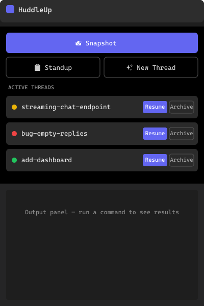
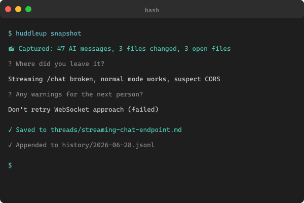
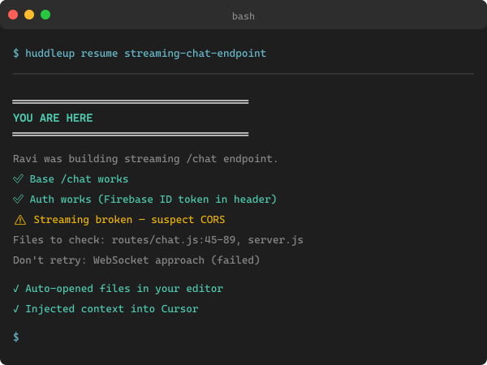

<p align="center">
  
</p>

<h1 align="center">HuddleUp for VS Code</h1>

<p align="center">
  <strong>Huddle up your team's AI coding sessions — snapshot and resume work across Claude Code, Cursor, Codex, Copilot, and Windsurf.</strong>
</p>

<p align="center">
  <a href="https://marketplace.visualstudio.com/items?itemName=AnandSundaramoorthySa.vscode-huddleup"></a>
  <a href="https://github.com/anandsundaramoorthysa/huddleup"></a>
  <a href="LICENSE"></a>
</p>

---

HuddleUp captures your work-in-progress AI coding session — git diff, open files, last AI messages, and your notes — then lets a teammate pick up exactly where you left off in whichever AI tool they use.

## Screenshots

| Sidebar Panel | Snapshot | Resume Briefing |
|---|---|---|
|  |  |  |

## Features

### 📸 Snapshot
Save your current AI coding session with one click. Captures git diff, open files, last AI messages, and your progress note automatically.

### ▶ Resume
Pick up any saved thread. Prints a full "you are here" briefing and opens the relevant files.

### 📋 Standup
See all active threads at a glance — what's blocked, in progress, or done today.

### ✨ Thread Management
Create, list, resume, and archive work threads from the sidebar panel.

## Requirements

- **Node.js 20+** installed
- HuddleUp CLI (`npm install -g huddleup`) or use via `npx huddleup`
- A project initialized with `huddleup init`

## Extension Commands

| Command | Description |
|---------|-------------|
| `HuddleUp: Snapshot current session` | Save current work state |
| `HuddleUp: Resume a thread` | Pick a thread to resume |
| `HuddleUp: Show team standup` | Show team status |
| `HuddleUp: Create new thread` | Start a new work item |
| `HuddleUp: List threads` | Show all active threads |
| `HuddleUp: Refresh sidebar` | Refresh the HuddleUp panel |

## How It Works

1. **Setup**: Run `huddleup init` in your project to scaffold `.huddleup/` and generate AI tool config files
2. **Work**: Code with your AI tool as usual
3. **Snapshot**: Click the Snapshot button or run `huddleup snapshot` before a break
4. **Handoff**: Your teammate opens the project, clicks Resume, and picks up where you left off

The generated AI tool config files include a **Token Exhaustion Protocol** — the AI auto-runs `huddleup snapshot` when tokens run low, so no one has to remember.

## Extension Settings

| Setting | Default | Description |
|---------|---------|-------------|
| `huddleup.cliPath` | `npx huddleup` | Path or command for the HuddleUp CLI |

## Building from Source

```bash
cd vscode-huddleup
npm install
npm run build
npm run package    # produces .vsix
```

## Questions?

- **Issues** — [github.com/anandsundaramoorthysa/huddleup/issues](https://github.com/anandsundaramoorthysa/huddleup/issues)
- **Discussions** — [github.com/anandsundaramoorthysa/huddleup/discussions](https://github.com/anandsundaramoorthysa/huddleup/discussions)
- **Email** — [sanand03072005@gmail.com](mailto:sanand03072005@gmail.com?subject=About%20HuddleUp%20VS%20Code%20Extension)

---

**License:** AGPL-3.0 + CLA
